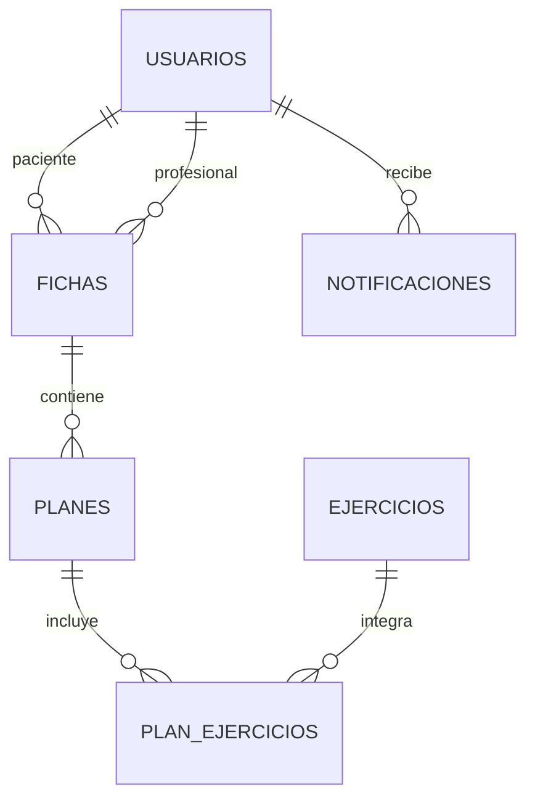

# Modelo de datos inicial

El modelo corresponde a una aplicacion web para un centro de kinesiologia. La version inicial contempla usuarios, fichas de tratamiento, planes, ejercicios y notificaciones.

## Entidades

- **usuarios**: personas que utilizan el sistema y su rol.
- **fichas**: informacion clinica y observaciones de tratamiento.
- **planes**: plan de tratamiento asociado a una ficha.
- **ejercicios**: catalogo de ejercicios disponibles.
- **plan_ejercicios**: relacion entre los planes y sus ejercicios.
- **notificaciones**: avisos enviados a los usuarios.

El archivo reproducible del esquema se encuentra en [`backend/DB/schema.sql`](../backend/DB/schema.sql) y la base SQLite inicial en [`backend/DB/kinesiologia.db`](../backend/DB/kinesiologia.db).
